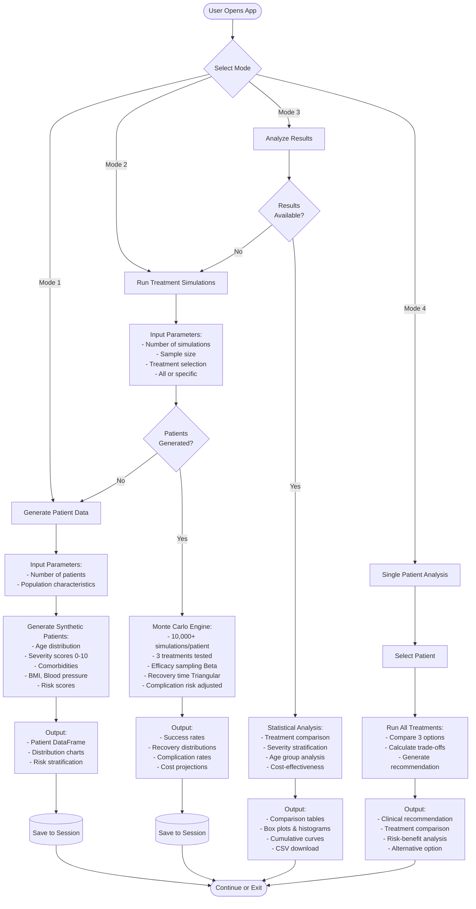
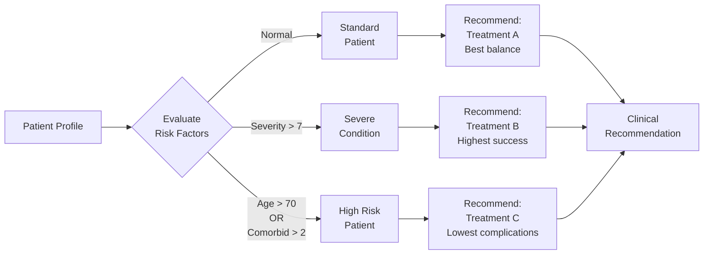

# Healthcare Treatment Optimization System - Process Flow

## System Architecture



## Data Flow Detail

### 1️⃣ Generate Patient Data
**Inputs:**
- Number of patients (50-1000)
- Population parameters (age mean, severity mean)

**Processing:**
- Sample age: Normal(55, 15), bounded [18, 90]
- Sample severity: Normal(5, 2), bounded [0, 10]
- Sample comorbidities: Poisson(1.5)
- Sample BMI: Normal(27, 5)
- Sample blood pressure: Normal(130, 18)
- Calculate composite risk score:
  ```
  Risk = (age_factor × 30) +
         (severity_factor × 40) +
         (comorbidity_factor × 20) +
         (bmi_factor × 5) +
         (bp_factor × 5)
  Range: 0-100
  ```

**Outputs:**
- DataFrame with patient profiles
- Age/severity distributions
- Risk score histogram
- Comorbidity breakdown

---

### 2️⃣ Run Treatment Simulations
**Inputs:**
- Generated patient data
- Number of simulations (1,000-20,000)
- Sample size (patients to simulate)
- Treatment options: A (Standard), B (New Med), C (Experimental)

**Processing (per patient, per treatment):**
```
FOR each simulation (1 to N):
  1. Sample treatment efficacy from Beta distribution:
     - Treatment A: Beta(8, 3) → ~72% mean
     - Treatment B: Beta(9, 2) → ~82% mean
     - Treatment C: Beta(5, 5) → ~50% mean

  2. Adjust efficacy for patient severity:
     adjusted_efficacy = base_efficacy × (1 - severity/10 × 0.20)

  3. Determine success (Bernoulli trial):
     success = random() < adjusted_efficacy

  4. Sample recovery time (Triangular distribution):
     - Treatment A: Tri(20, 30, 45) days
     - Treatment B: Tri(15, 25, 38) days
     - Treatment C: Tri(25, 35, 60) days
     If unsuccessful: recovery_time × 1.5

  5. Calculate complication risk:
     age_factor = 1 + (age - 55)/100
     comorbidity_factor = 1 + (comorbidities × 0.10)
     adjusted_rate = base_rate × age_factor × comorbidity_factor

  6. Determine complications (Bernoulli trial):
     has_complication = random() < adjusted_rate
     If yes: recovery_time × 1.3

  7. Calculate total cost:
     cost = base_cost
     IF complication: cost += complication_cost

  8. Store: success, recovery_days, complication, cost
END FOR

Calculate statistics across all simulations
```

**Treatment Parameters:**
| Treatment | Efficacy | Recovery (days) | Complication | Base Cost | +Complication |
|-----------|----------|-----------------|--------------|-----------|---------------|
| A (Standard) | Beta(8,3) | Tri(20,30,45) | 15% | $5,000 | +$8,000 |
| B (New Med) | Beta(9,2) | Tri(15,25,38) | 25% | $12,000 | +$15,000 |
| C (Experimental) | Beta(5,5) | Tri(25,35,60) | 10% | $8,000 | +$10,000 |

**Outputs:**
- Success rate (mean of success trials)
- Complication rate (mean of complication trials)
- Recovery time: mean, median, 5th/95th percentiles
- Cost: mean, median, 5th/95th percentiles, VaR
- Full results DataFrame

---

### 3️⃣ Analyze Results
**Inputs:**
- Simulation results from all patients
- Patient characteristics

**Processing:**
- **Overall Statistics:**
  - Success rate by treatment
  - Mean recovery time by treatment
  - Complication rate by treatment
  - Cost distributions by treatment

- **Severity Stratification:**
  - Low (0-3), Moderate (3-7), High (7-10)
  - Success rates by severity × treatment

- **Age Group Analysis:**
  - Young (<40), Middle (40-65), Elderly (>65)
  - Complication rates by age × treatment

- **Visualization (8 panels):**
  1. Success rate bars
  2. Recovery time box plots
  3. Cost distributions
  4. Complication rate bars
  5. Recovery histograms (overlaid)
  6. Cumulative probability curves
  7. Cost vs success scatter
  8. Performance heatmap

**Outputs:**
- Summary comparison table
- Statistical significance tests
- Best treatment by metric
- Interactive charts
- CSV export

---

### 4️⃣ Single Patient Analysis
**Inputs:**
- Selected patient ID
- All simulation results for that patient

**Processing:**
- Extract results for all 3 treatments
- Compare metrics side-by-side
- Apply clinical decision logic:
  ```
  Score each treatment:
    success_score = success_rate × 50
    recovery_score = (1 - recovery_mean/60) × 25
    complication_score = (1 - complication_rate) × 25
    total_score = sum of components

  IF patient.age > 70 OR patient.comorbidities > 2:
      Prioritize: lowest complication rate
  ELIF patient.severity > 7:
      Prioritize: highest success rate
  ELSE:
      Recommend: highest total_score
  ```

**Outputs:**
- Primary recommendation with rationale
- Expected outcomes (success, recovery, cost)
- 90% confidence intervals
- Risk level: Low/Medium/High
- Alternative treatment option
- Clinical interpretation

---

## Key Features

✅ **Clinical Realism:**
- Beta distributions for efficacy (bounded 0-1)
- Triangular for recovery (min/mode/max from literature)
- Patient-specific risk adjustments (age, comorbidities)
- Complication rates vary by treatment and patient

✅ **Monte Carlo Variables:**
- Treatment efficacy: Beta(α, β) per treatment
- Recovery time: Triangular(min, mode, max)
- Complications: Bernoulli(adjusted_rate)
- Patient factors: Age, severity, comorbidities adjust outcomes

✅ **Output Metrics:**
- Success Rate: % of simulations with successful treatment
- Recovery Time: Days until recovery (mean, median, CI)
- Complication Rate: % of simulations with adverse events
- Total Cost: Treatment + complications
- Value at Risk (VaR): 95th percentile cost

---

## Decision Support Logic



---

## Technical Stack

**Language:** Python 3.10
**Core Libraries:** NumPy, Pandas, SciPy
**Visualization:** Matplotlib, Seaborn, Streamlit
**Statistics:** Beta/Triangular/Bernoulli distributions
**Deployment:** Streamlit Cloud
**Data:** Synthetic (clinically-calibrated parameters)

---

## Statistical Foundations

**Why Beta Distribution for Efficacy?**
- Bounded between 0 and 1 (valid probability)
- Flexible shape (α, β parameters)
- Represents uncertainty in success rates
- Beta(8,3) = 72% mean, moderate variance
- Beta(9,2) = 82% mean, low variance
- Beta(5,5) = 50% mean, high variance

**Why Triangular for Recovery Time?**
- Simple parameterization (min, mode, max)
- Captures expert estimates without extensive data
- Skewed distributions possible
- Clinically interpretable

**Why Bernoulli for Complications?**
- Binary outcome (yes/no)
- Single probability parameter
- Adjusted for patient characteristics
- Realistic clinical modeling

---

**Author:** Horacio Fonseca
**Repository:** https://github.com/horacefonseca/healthcare_montecarlo_analysis
